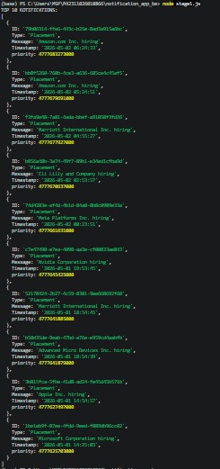
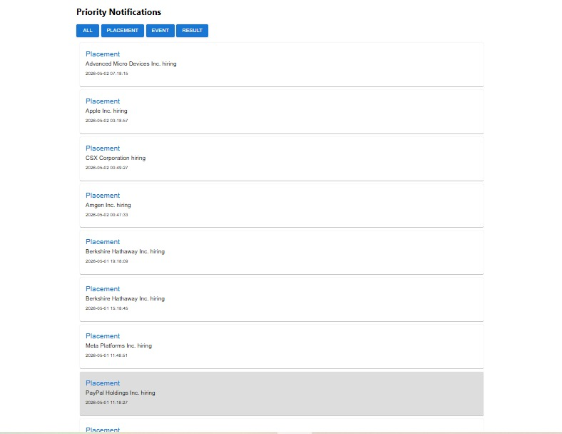
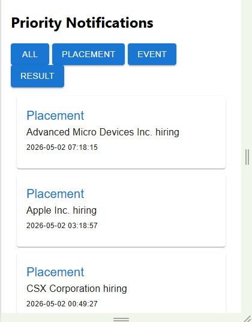

# Campus Notification System

## Overview
This project implements a campus notification system with a Priority Inbox that highlights the most important notifications based on type and recency.

---

## Features

- Priority Notifications (Top 10)
- Sorting based on:
  - Placement > Result > Event
  - Latest timestamp
- Filter by notification type
- Viewed vs Unviewed notification tracking
- Responsive UI (Desktop + Mobile)
- Logging Middleware integrated across backend

---

## Tech Stack

- Frontend: React + Material UI
- Backend: Node.js (Express)
- Logging Middleware: Custom reusable function

---

## Architecture

Due to CORS restrictions from the external API, a backend proxy server was implemented.

Flow:
Frontend → Backend Proxy → External API

---

## Priority Logic

Each notification is assigned a priority score:

priority = weight × large_number + timestamp

Weights:
- Placement = 3
- Result = 2
- Event = 1

Top 10 notifications are selected after sorting.

---

## Screenshots

### Backend Output

### Desktop UI

### Mobile UI

---

## How to Run

### Backend
cd notification_app_be  
node server.js  

### Frontend
cd notification_app_fe  
npm install  
npm start  

---

## Notes

- Logging middleware is used instead of console logs
- Token-based authentication implemented
- Clean and modular code structure followed
